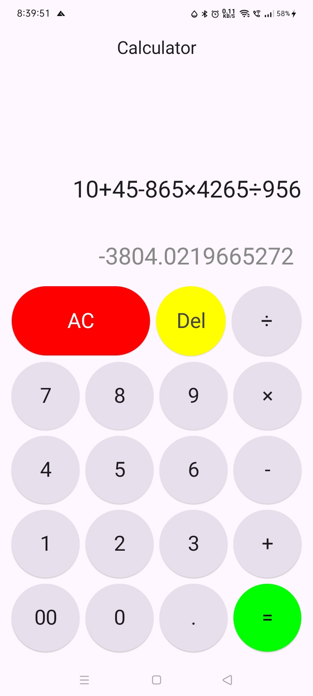
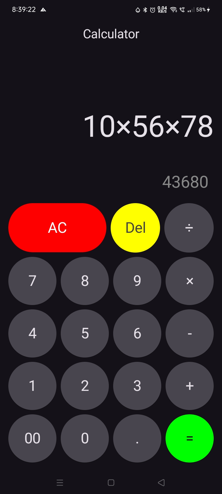

# Calculator App 📱

This is a basic calculator app built with Jetpack Compose.  
⚠️ Note: This app is for learning purposes only and may produce incorrect results.

## Features
- Basic arithmetic operations
- Real-time result preview
- Haptic feedback on button press

## Built With
- Kotlin
- Jetpack Compose
- MVVM architecture

| Light Mode                          | Dark Mode                         |
|-------------------------------------|-----------------------------------|
|  |  |
